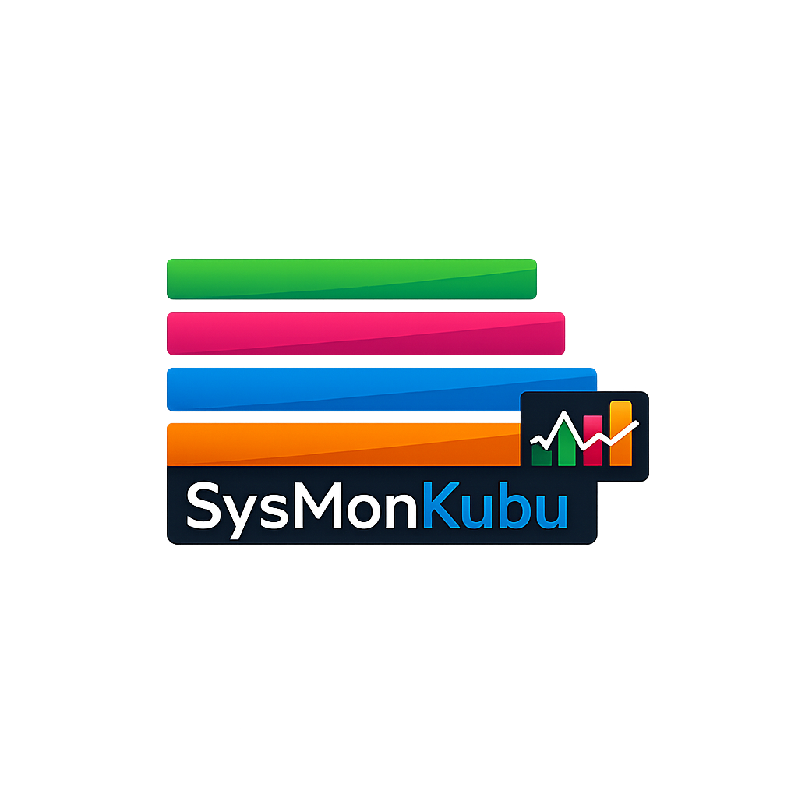

# SysMonKubu

**Real-time system monitor widget for KDE Plasma 6**

<p align="center">
  
</p>

SysMonKubu is a lightweight Plasma applet that displays real-time system resource usage directly in your panel. It shows CPU, GPU, RAM, and disk usage at a glance with color-coded bars and labels.

## Features

- **Real-time monitoring** - Updates every 500ms
- **Multi-GPU support** - Works with NVIDIA, AMD, and Intel graphics
- **Color-coded display** - Green (CPU), Pink (GPU), Blue (RAM), Orange (Disk)
- **Configurable colors** - Click to open popup and customize each color
- **Compact design** - Minimal footprint on your panel
- **Open source** - GPLv3 licensed

## Requirements

- KDE Plasma 6.x
- Linux with `/proc` filesystem
- Optional: `nvidia-smi` for NVIDIA GPU monitoring

## Installation

### From KDE Store (recommended)

1. Open **System Settings** → **Plasma Widgets**
2. Search for "SysMonKubu"
3. Click **Install**

### Manual Installation from archive

```bash
# Build the archive (from project root)
tar -cf SysMonKubu.plasmoid metadata.json contents/ LICENSE

# Install
kpackagetool6 --type Plasma/Applet --install SysMonKubu.plasmoid

# Or upgrade if already installed (using .tar extension)
tar -cf SysMonKubu.tar metadata.json contents/ LICENSE
kpackagetool6 --type Plasma/Applet --upgrade SysMonKubu.tar
```

### Direct install (no archive)

```bash
# Create directory and copy files
mkdir -p ~/.local/share/plasma/plasmoids/SysMonKubu/contents/{ui,scripts,config}
cp metadata.json ~/.local/share/plasma/plasmoids/SysMonKubu/
cp contents/ui/main.qml ~/.local/share/plasma/plasmoids/SysMonKubu/contents/ui/
cp contents/scripts/monitor.sh ~/.local/share/plasma/plasmoids/SysMonKubu/contents/scripts/
cp contents/config/main.xml ~/.local/share/plasma/plasmoids/SysMonKubu/contents/config/

# Rebuild cache and restart Plasma
kbuildsycoca6
systemctl --user restart plasma-plasmashell
```

### Development with symlink (live updates)

Link the project directory directly so changes reflect after a Plasma restart:

```bash
ln -sf /path/to/sysmonkubu ~/.local/share/plasma/plasmoids/SysMonKubu
systemctl --user restart plasma-plasmashell
```

After modifying any file, restart Plasma to reload:
```bash
systemctl --user restart plasma-plasmashell
```

### Add to Panel

1. Right-click on your panel
2. Select **Add Widgets**
3. Search for "SysMonKubu"
4. Drag it to your panel

## Project Structure

```
sysmonkubu/
├── metadata.json          # Plasmoid metadata (name, version, license, etc.)
├── contents/
│   ├── ui/
│   │   └── main.qml       # Widget UI (compact panel + popup)
│   ├── scripts/
│   │   └── monitor.sh     # Shell script that collects system data
│   └── config/
│       └── main.xml       # Configuration schema (color defaults)
├── SysMonKubu.plasmoid    # Distribution archive (generated)
├── LICENSE                # GPLv3
└── README.md
```

### How the data pipeline works

1. `Plasma5Support.DataSource` with `engine: "executable"` is configured with `interval: 500`
2. The executable engine runs `monitor.sh` every 500ms via the `interval` timer
3. Script reads `/proc/stat`, RAM from `free`, disk from `df`, GPU from `nvidia-smi` or `/sys/class/drm/`
4. Returns space-separated values: `CPU% GPU% RAM% DISK%`
5. `onNewData` handler parses the output and updates QML properties
6. UI bindings auto-update the progress bars and labels

## Usage

The widget displays four metrics in your panel:

| Color | Metric | Description |
|-------|--------|-------------|
| 🟢 Green | CPU | Processor usage percentage |
| 🩷 Pink | GPU | Graphics card usage percentage |
| 🔵 Blue | RAM | Memory usage percentage |
| 🟠 Orange | DISK | Root partition usage |

Click on the widget to open the popup and customize colors.

## Building the .plasmoid archive

```bash
# From project root - creates an uncompressed tar (required by kpackagetool6)
tar -cf SysMonKubu.plasmoid metadata.json contents/ LICENSE
```

Optionally gzip for distribution:
```bash
gzip -c SysMonKubu.plasmoid > SysMonKubu.plasmoid.tar.gz
```

The archive contains:
- `metadata.json` at root level
- `contents/ui/main.qml`
- `contents/scripts/monitor.sh`
- `contents/config/main.xml`
- `LICENSE`

## Supported GPUs

- **NVIDIA** - Uses `nvidia-smi`
- **AMD** - Reads from `/sys/class/drm/card*/device/gpu_busy_percent`
- **Intel** - Reads from `/sys/class/drm/card*/device/gpu_busy_percent`
- **Others** - Displays 0%

## Customization

### Colors

Click the widget in the panel to open the popup, then enter hex color codes (e.g. `#2ecc71`).

### Monitor interval

The update interval is hardcoded at 500ms in `main.qml`. Edit the `Timer.interval` value to change it.

### Script behavior

Edit `contents/scripts/monitor.sh` to customize:
- Disk partition to monitor (default: `/`)
- CPU sampling interval (default: `sleep 0.1`)
- GPU detection priority

## Troubleshooting

### Widget not appearing
```bash
kbuildsycoca6
systemctl --user restart plasma-plasmashell
```

### Values not updating
Check the log for errors:
```bash
journalctl --user -u plasma-plasmashell --since "5 minutes ago" | grep -i sysmonkubu
```

Common causes:
- Script path is wrong in `main.qml` (check `scriptPath`)
- `interval` property not set on DataSource (required for auto-refresh in Plasma 6)
- DataSource `connectedSources` not set to the command array

### GPU shows 0%
- Ensure `nvidia-smi` is installed for NVIDIA cards
- AMD/Intel GPUs require kernel support for `gpu_busy_percent`

### Permission errors
The script reads system files that require read permissions. Most users won't encounter issues.

## License

**GPLv3** - See LICENSE file for details.

---

Made with ❤️ by **Dario Chiapperini**

- Website: [dariochiapperini.dev](https://dariochiapperini.dev)
- GitHub: [@darchidev](https://github.com/darchidev)
- KDE Store: [SysMonKubu](https://store.kde.org)


<p align="center">
  <sub>SysMonKubu © 2026 Dario Chiapperini</sub>
</p>
